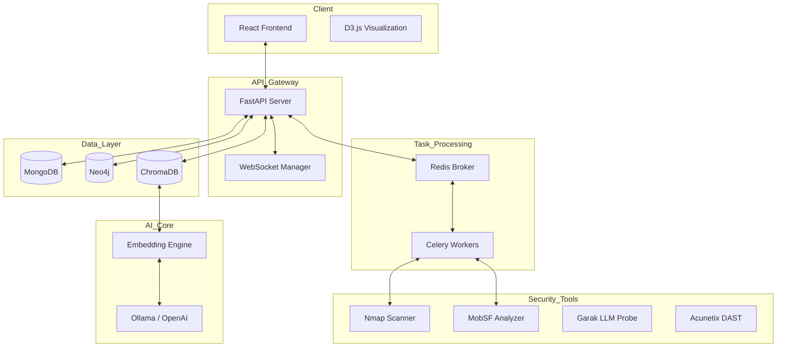

# HACKNOVA Hackathon — CyberGuard
## AI-Assisted Cybersecurity Hub

CyberGuard is a next-generation, AI-driven cybersecurity platform designed to automate vulnerability assessment, threat intelligence, and attack surface management. Built for the **HACKNOVA Hackathon**, it combines industry-standard security tools with advanced Large Language Models (LLMs) to provide a "graph-first" view of organizational security.

---

## 🚀 Key Features

### 1. 📊 Centralized Security Dashboard
A high-level command center providing a real-time snapshot of the organization's security posture, tracking active scans, critical vulnerabilities, and global threat levels.
> 

### 2. 🧠 LLM Scanner (AI-Security)
Securing the intelligence itself. Uses Garak and specialized probes to test Large Language Models for jailbreaks, prompt injections, and data leakage.
> 

### 3. 🌎 Global Threat Intelligence
Continuous monitoring of NVD, MITRE, and Rapid7 feeds. Automatically correlates global CVE data with your specific assets to provide actionable alerts.

### 4. 🌍 Attack Surface Management (Recon)
Deep reconnaissance mapping of subdomains, open ports, and running services. Provides a "hacker’s eye view" of the entire infrastructure.

### 5. 🕵️‍♂️ Credential Leak Monitoring
Proactive monitoring of dark web and public data dumps to identify exposed corporate credentials before they are exploited.

### 6. 📱 Mobile Security Analysis
Deep static and dynamic analysis (SAST/DAST) of APK/IPA files using MobSF integration, looking for hardcoded secrets and insecure coding patterns.

### 7. 🕸️ Attack Graph Visualization
Goes beyond flat lists. Visualizes potential attack paths from an external attacker to your most sensitive assets, helping prioritize remediation where it matters most.
> 

### 8. 💬 AI Chat & RAG Assistant
A context-aware security expert assistant powered by Retrieval-Augmented Generation (RAG). It has access to your specific report data and technical documentation to provide step-by-step remediation guidance.

---

## 🛠 Tech Stack

### Frontend
- **React (Vite)**: High-performance modern web framework.
- **Vanilla CSS**: Premium "Glassmorphism" UI design for a professional, dark-themed experience.
- **D3.js**: Interactive force-directed graphs for attack path visualization.
- **React Router**: Seamless client-side navigation.

### Backend
- **FastAPI**: High-performance, asynchronous Python web framework.
- **Motor / MongoDB**: Flexible, async document storage for scan results and user data.
- **Celery / Redis**: Distributed task queue for long-running security scans (Nmap, MobSF, etc.).
- **Neo4j**: Graph database for storing and querying complex attack relationships.

### AI Engine
- **Ollama / OpenAI**: Inference engines for Large Language Models.
- **ChromaDB**: Vector database for RAG (Retrieval-Augmented Generation).
- **Sentence-Transformers**: Text embeddings for matching threats to documentation.

---

## 🏗 System Architecture



---

## 🔧 Installation & Setup

1. **Clone the repository**:
   ```bash
   git clone https://github.com/anshu787/hacknova_ps.git
   cd hacknova_ps
   ```

2. **Backend Setup**:
   ```bash
   cd backend
   pip install -r requirements.txt
   uvicorn main:app --reload --port 8000
   ```

3. **Frontend Setup**:
   ```bash
   cd frontend
   npm install
   npm run dev
   ```

4. **Environment Variables**:
   Copy `.env.example` to `.env` and configure your MongoDB, Redis, and LLM endpoints.

---

## 🏆 HACKNOVA Hackathon Submission
Created with ❤️ for the HACKNOVA Hackathon. CyberGuard represents the future of AI-driven cybersecurity orchestration.
